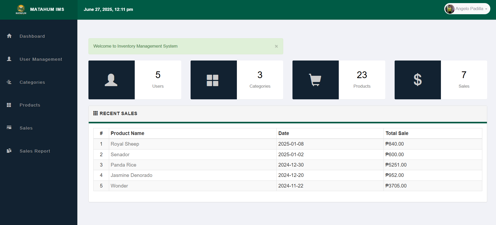
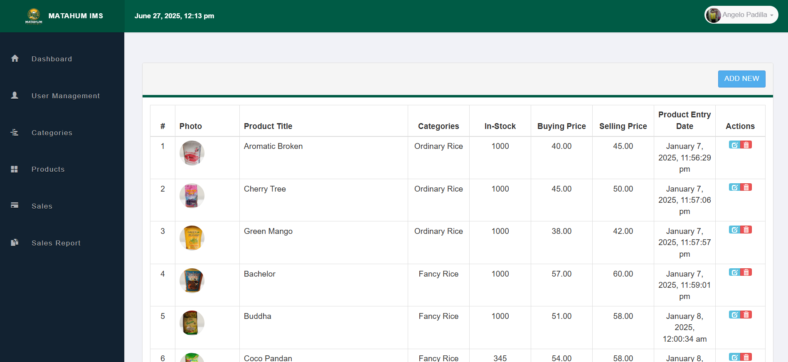
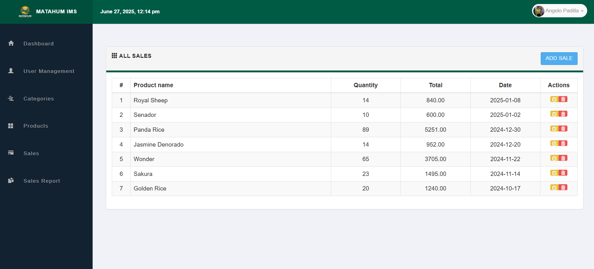
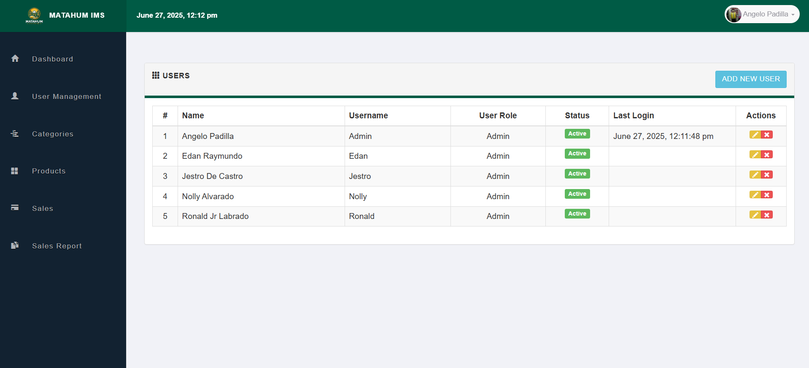

# Matahum Rice Inventory Management System

A web-based inventory system built for a local rice trading business to monitor and manage their rice stocks, and deliveries. Designed to improve inventory visibility, reduce manual record-keeping, and provide reliable reporting for small business operations.

🎓 **School Project** | 👥 **Client-Based**

🔗 [**Landing Page**](https://matahum-rice-retailing-inventory-ma.vercel.app/)   
🔗 [**Inventory Demo**]()  

---

## 🔧 Tech Stack

- **Frontend/Backend**: PHP  
- **Database**: MySQL  
- **Tools**: XAMPP, phpMyAdmin, GitHub

---

## 📂 Features

- ✅ Stock-in and stock-out tracking  
- ✅ Product and category management  
- ✅ Inventory reports and summaries  
- ✅ Supplier and transaction tracking  
- ✅ User authentication (Admin/Staff roles)  
- ✅ Responsive layout for desktops and tablets

---

## 🖼️ Screenshots

   
  <strong>Login Page</strong>
    

   
  <strong>Dashboard</strong>
    

   
  <strong>Products Page</strong>
    

   
  <strong>Sales Page</strong>
    

   
  <strong>User Management</strong>
    

---

